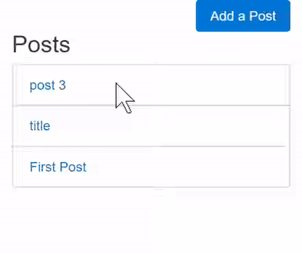

# ReactReduxForm

I built this blog app to learn how to use the react-router library. It makes REST API calls to a blog database. Then, once information has been fetched from the database, it uses the redux library to manage the blog data so that it is loaded instantaneously. 



## Demo
https://aqueous-hollows-61571.herokuapp.com/

### Getting Started

There are two methods for getting started with this repo.

#### Familiar with Git?
Checkout this repo, install dependencies, then start the gulp process with the following:

```
> git clone https://github.com/rdoner/ReactReduxForm.git
> cd WeatherApp
> npm install
> npm start
```

#### Not Familiar with Git?
Click [here](https://github.com/rdoner/ReactReduxForm.git) then download the .zip file.  Extract the contents of the zip file, then open your terminal, change to the project directory, and:

```
> npm install
> npm start
```

## Author
Ryan Doner
